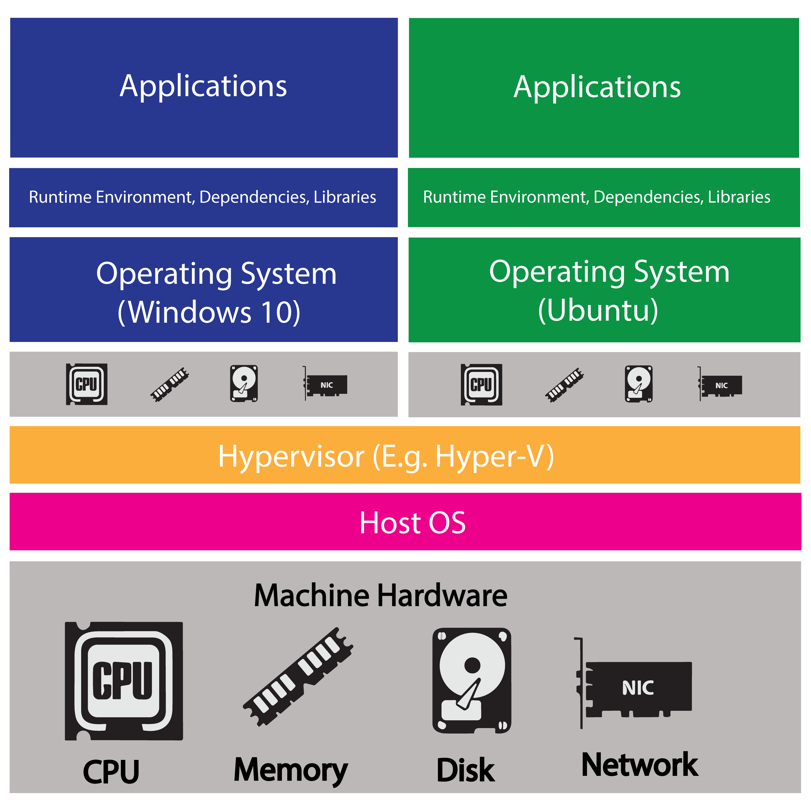
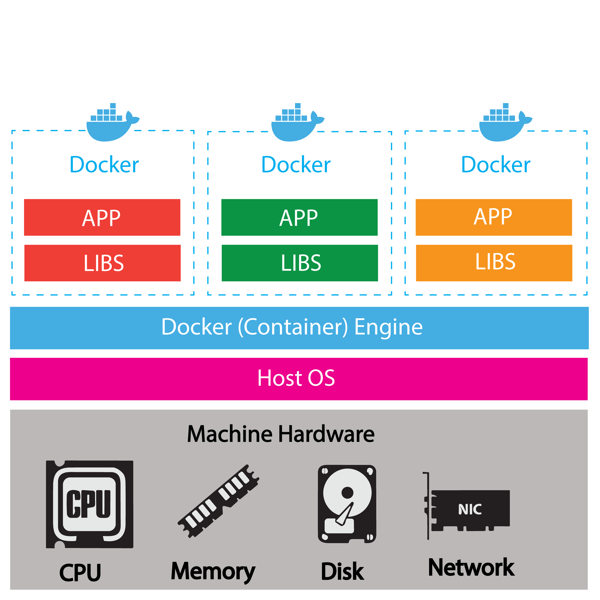

# Docker with GitLab CI

## Table of Contents

- [Introduction](#introduction)
- [Understanding Docker](#understanding-docker)
    - [Docker Images](#docker-images)
    - [Docker for Deploying Applications](#docker-for-deploying-applications)
- [Docker and Virtual Machines](#docker-and-virtual-machines)
- [Docker and Continuous Integration](#docker-and-continuous-integration)
- [Conclusion](#conclusion)
- [References](#references)

## Introduction

Welcome! If you've heard about Docker but aren't sure exactly what it is or how it works, this guide is for you. This guide will give you a fundamental understanding of Docker, a platform that uses OS-level virtualization to deliver software in packages known as containers. By the end, you should have a basic understanding of Docker and its importance in a Continuous Integration (CI) environment, particularly with GitLab.

## Understanding Docker

Docker is based on container technology, which simplifies the process of running, deploying, and building applications. Containers are similar to virtual machines, but they're more portable and efficient.

### Docker Images

Docker utilizes something called "images". An image is a file that contains a set of instructions on how to package up code, utilities, and all dependencies. When Docker runs an image, it becomes a container, which you can think of as a lightweight virtual machine.

For example, let's say you want to run a Node.js application. Traditionally, you'd need to download and install the correct version of Node.js on your system before you can run your app. With Docker, however, you can create an image with Node.js pre-installed, so all you need to do is start the Docker container to run your app.

### Docker for Deploying Applications

Docker makes it easier to deploy applications. It allows developers to package an application along with all its necessary dependencies into a container, which can then be deployed and run anywhere Docker is installed. This guarantees that the application will always run the same, regardless of the environment.

## Docker and Virtual Machines

Docker can be viewed as a lightweight alternative to traditional virtual machines. Like a VM, a Docker container encapsulates an application and its dependencies. However, while a VM includes a full copy of an operating system, a Docker container shares the OS kernel with other containers, making it much more efficient.

### Virtual Machine

A virtual machine (VM) is a software emulation of a physical computer. It allows you to run multiple operating systems on a single physical machine, providing isolation and flexibility. Each VM has its own virtual hardware, including CPU, memory, storage, and network interfaces.

Virtual machines are commonly used for various purposes, such as testing software on different operating systems, running legacy applications, or creating development environments. They provide a way to abstract the underlying hardware and create a consistent environment for applications to run.

### Docker Container

A Docker container is a lightweight and isolated runtime environment that encapsulates an application and its dependencies. It is created from a Docker image, which contains all the necessary files, libraries, and configurations required to run the application.

Unlike a virtual machine, a Docker container shares the host operating system's kernel, making it more efficient and lightweight. Containers can be easily deployed and scaled, providing consistent and reproducible environments for running applications.

Docker containers offer portability, allowing applications to run consistently across different environments, from development to production. They also enable easy management and versioning of applications, making it simple to update and roll back changes.

## Docker and Continuous Integration

In a CI environment, using Docker offers significant benefits. Traditionally, a CI server needs to have all required tools and packages installed, which can become problematic. For example, if different tools need different versions of Node.js, you cannot install two versions of Node.js on the same server.

With Docker, however, each tool can have its own Docker image with the exact version of Node.js (or any other dependency) it requires. This way, different tools can run in their own containers independently, each with their own specific environment.

In GitLab CI, this is accomplished by specifying a Docker image to use for each CI job. The CI runner then starts a container from that image, providing a precisely controlled environment for each job.

## Conclusion

Docker is a powerful tool that simplifies the process of creating, deploying, and running applications by using containers. It's particularly useful in Continuous Integration scenarios, as it provides each job with a specific, controlled environment. Hopefully, this guide has given you a basic understanding of Docker and its importance in a CI context, especially with GitLab.

## References

- [Docker Documentation - Get Started with Docker](https://docs.docker.com/get-started/)
- [GitLab Documentation - Using Docker Images](https://docs.gitlab.com/ee/ci/docker/using_docker_images.html)