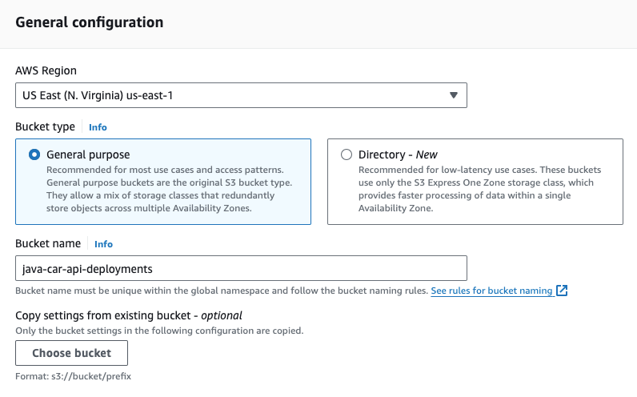
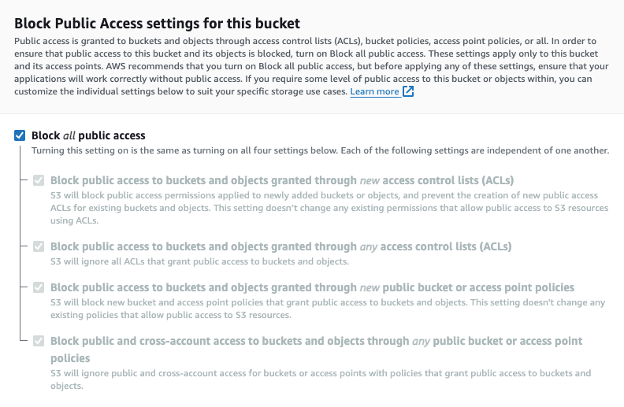
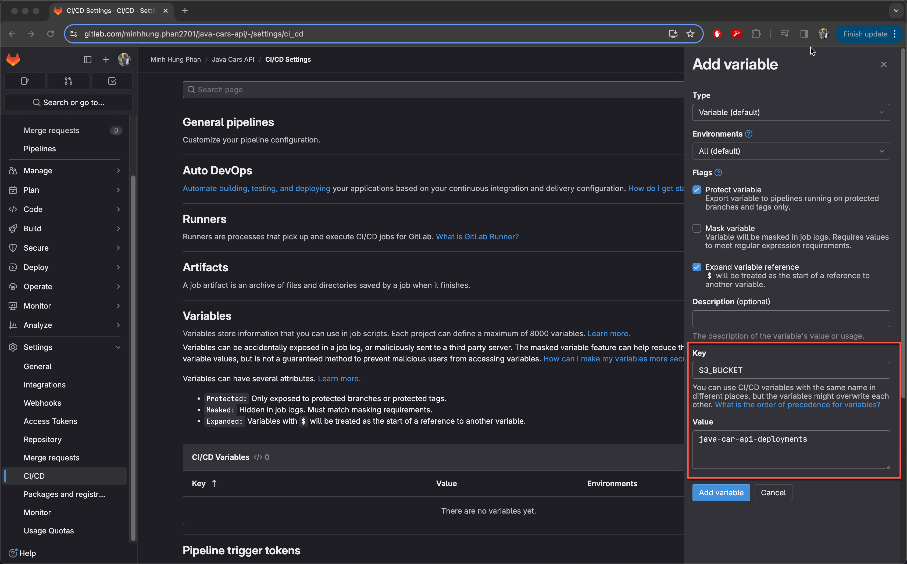
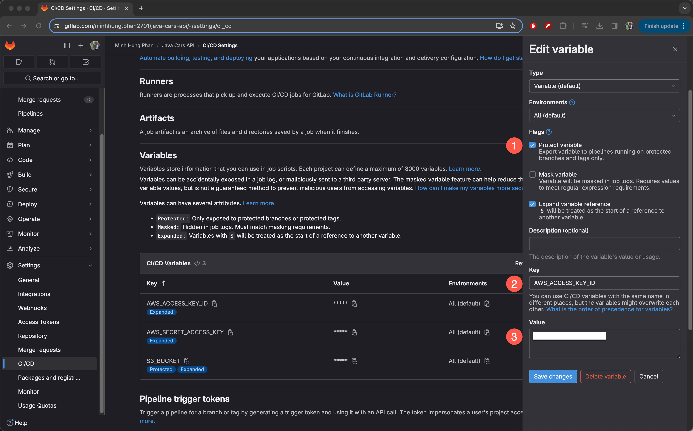
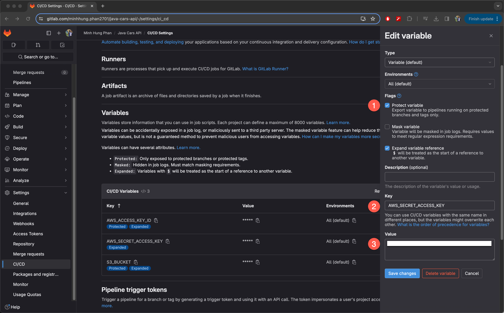

# How to Upload a File to S3 from GitLab CI

Welcome to this comprehensive guide on uploading files to Amazon S3 (Simple Storage Service) using GitLab CI. This document aims to provide a straightforward and beginner-friendly approach to leveraging GitLab CI for automating the process of file uploads to AWS S3. Whether you're managing application deployments, storing artifacts, or simply need to automate your file management, this guide will walk you through the necessary steps, best practices, and key takeaways.

## Table of Contents

- [Introduction](#introduction)
- [Setting Up AWS S3 Bucket](#setting-up-aws-s3-bucket)
- [Configuring GitLab CI for S3 Uploads](#configuring-gitlab-ci-for-s3-uploads)
- [Creating AWS IAM User for GitLab CI](#creating-aws-iam-user-for-gitlab-ci)
- [Configuring GitLab CI for S3 Uploads](#configuring-gitlab-ci-for-s3-uploads)
- [Best Practices](#best-practices)
- [Key Takeaways](#key-takeaways)
- [Conclusion](#conclusion)
- [References](#references)

## Introduction

The need for automating file uploads is critical in today's fast-paced development environments. Amazon S3 offers scalable storage solutions, while GitLab CI provides the automation needed to streamline your workflows. Combining these two can significantly enhance your project's efficiency and reliability.

## Setting Up AWS S3 Bucket

Before integrating GitLab CI with S3, you need to set up an S3 bucket. Here's how:

1. **Navigate to AWS Management Console** and select S3 under Storage.

2. **Create a new bucket**. Remember, bucket names must be globally unique. For instance, "java-car-api-deployments" could be a suitable name for our use case.



3. **Configure settings** as default, but ensure to **block public access** to keep your data secure.



4. **Review and create** the bucket. After creation, the bucket will be ready to store files but will initially be empty.

Example Bucket Creation CLI Command:

```sh
aws s3 mb s3://java-car-api-deployments --region us-east-1
```

## Creating AWS IAM User for GitLab CI

To automate the process of uploading files to AWS S3 from GitLab CI, you need to create a dedicated IAM (Identity and Access Management) user within AWS. This user, which we'll name "gitlabci", requires specific permissions to access and manipulate S3 resources. Here's a detailed guide to creating this user and attaching the AmazonS3FullAccess policy for the necessary permissions.

### Step 1: Navigating to IAM in AWS Management Console

1. **Log in to AWS Management Console**: Access your AWS account and go to the AWS Management Console homepage.
2. **Open IAM Dashboard**: Find and click on "IAM" under the Services menu, which takes you to the IAM dashboard. IAM is responsible for managing access to AWS services and resources securely.

### Step 2: Creating the "gitlabci" IAM User

1. **Access Users Section**: In the IAM dashboard, click on "Users" in the navigation pane on the left side.
2. **Add User**: Click the "Add user" button to start creating a new IAM user.
3. **Set User Details**:

- **User name**: Enter `gitlabci` as the user name. This name will be used in GitLab CI to authenticate with AWS.
- **Access type**: Check the "Programmatic access" option. This allows the user to access AWS services via the API, CLI, and other development tools, which is essential for automation with GitLab CI.

### Step 3: Attaching Permissions

1. **Set Permissions**: After setting the user details, click on "Next: Permissions" to proceed to the permissions setup.
2. **Attach Policy Directly**: Choose "Attach existing policies directly" for a straightforward way to grant permissions.
3. **Search and Select Policy**: In the policy search box, type `AmazonS3FullAccess` and check the policy when it appears. This policy grants the user full access to S3, enabling them to upload, download, and modify objects in any S3 bucket.
4. **Review and Create**: After selecting the policy, click on "Next: Tags" (optional step, you can skip setting tags) and then "Next: Review" to review the user and policy details. Ensure everything is correct and then click "Create user".

## Generating Access Keys for the "gitlabci" IAM User

After creating your IAM user with the necessary permissions for S3 access, you'll need to generate access keys. These keys allow your GitLab CI pipelines to authenticate with AWS and perform actions such as uploading files to S3. Here's a step-by-step guide to creating these access keys:

### Accessing IAM

1. **Open the AWS Management Console**: Log in to your AWS account and navigate to the IAM (Identity and Access Management) dashboard. This is where you manage access to AWS resources.
2. **Users**: In the IAM dashboard, click on "Users" from the sidebar menu. This displays a list of IAM users associated with your AWS account.

### Creating Access Keys for "gitlabci"

1. **Select Your User**: Find the "gitlabci" user in the list and click on the user name to open the user details page.
2. **Security Credentials Tab**: Within the user's detail page, navigate to the "Security Credentials" tab. This section contains the access keys, among other security credentials.

### Generating New Access Keys

1. **Create Access Key**: Click on the "Create Access Key" button. A new access key ID and secret access key will be generated for the "gitlabci" user.
2. **Download Credentials**: AWS will offer you the option to download the keys as a `.csv` file. It is crucial to download and securely save this file because the secret access key is only shown once and cannot be retrieved later. If you lose the secret access key, you will have to create a new access key pair.

## Configuring GitLab CI for S3 Uploads

To automate the upload of files to AWS S3 within your CI/CD pipeline in GitLab, you need to configure your GitLab CI/CD settings appropriately. This includes setting environment variables for your AWS credentials, the name of the S3 bucket where your files will be uploaded, and ensuring secure handling of your access keys. For this example, we will use a bucket named `java-car-api-deployments`. Follow these steps to effectively configure GitLab CI for S3 uploads.

### Step 1: Setting Environment Variables in GitLab

In GitLab CI/CD, environment variables are used to store values that control the behavior of your pipeline runs. You'll need to add variables for your AWS access keys, which you obtained when creating your `gitlabci` IAM user, and the name of your S3 bucket.

1. **Open Your Project in GitLab**: Navigate to the GitLab project you've designated for S3 uploads.

2. **Access CI/CD Settings**: Within your project dashboard, find and click on Settings > CI/CD to enter the configuration area for your continuous integration and deployment settings.

3. **Expand the Variables Section**: Look for the "Variables" section and click to reveal its contents. This section allows you to define key-value pairs that your CI/CD pipeline can use.

4. **Configure S3 Bucket Variable**:

- Select "Add Variable" to create a new environment variable.
- For the "Key" field, input `S3_BUCKET`. This will serve as the identifier for your S3 bucket within the GitLab CI/CD environment.
- Enter `java-car-api-deployments` into the "Value" field, which specifies the target S3 bucket for your uploads.
- Make sure to leave the "Mask variable" option unchecked, as masking is not necessary for this kind of variable. However, consider checking the "Protect variable" option if you want this variable to be accessible only in protected branches or tags, thereby enhancing your project's security.



5. **Add AWS Access Keys Variables**:

- Continuing in the Variables section, add another new variable with the key `AWS_ACCESS_KEY_ID` and set its value to the Access Key ID you obtained from the AWS `.csv` file during the IAM user creation process.



- Add a second variable with the key `AWS_SECRET_ACCESS_KEY`, assigning it the Secret Access Key from the same `.csv` file.



- For both of these AWS access key variables, ensure you mark them as "Protected". This ensures they are only exposed to jobs running on protected branches or tags, thus safeguarding your AWS account's security.


### Step 2: Modifying `.gitlab-ci.yml` for S3 Uploads

With your environment variables set, the next step is to modify your `.gitlab-ci.yml` file. This file defines your CI/CD pipeline in GitLab. You'll add a job to this pipeline specifically for uploading files to your S3 bucket.

1. **Open or Create `.gitlab-ci.yml`**: In your project repository, open your `.gitlab-ci.yml` file. If you don't have one, create it at the root of your repository.

2. **Define Upload Job**: Add a new job to your `.gitlab-ci.yml` that uses the AWS CLI to upload files to S3. Here's an example job definition:

```yaml
stages:
  - build
  - test
  - deploy
# ... existing code ...
deploy:
  stage: deploy
  image:
    name: amazon/aws-cli
    entrypoint: [""]
  script:
    - aws configure set region us-east-1
    - aws s3 cp ./build/libs/cars-api.jar s3://$S3_BUCKET/cars-api.jar
```

### Step 3: Commit and Push Changes

After adding the S3 upload job to your `.gitlab-ci.yml`, commit your changes and push them to your repository. GitLab CI/CD will automatically pick up the changes and run your pipeline, including the new job to upload files to S3.

## Best Practices

- **Secure your AWS Keys**: Never hard-code your AWS keys. Use GitLab's variables to store sensitive information.
- **Use specific IAM roles**: Limit the permissions of the IAM user to only what's necessary for the job.
- **Monitor S3 Bucket Usage**: Regularly check your S3 usage to avoid unexpected charges.

## Key Takeaways

- **Automation Enhances Efficiency**: Automating the upload process saves time and reduces the risk of human error.
- **Security is Paramount**: Using IAM roles and GitLab's variable system keeps your credentials secure.
- **Flexibility in Storage and Deployment**: S3's scalable nature, combined with GitLab CI's automation, offers a robust solution for handling files in CI/CD pipelines.

## Conclusion

Integrating GitLab CI with AWS S3 streamlines the process of managing and deploying files, making it an essential skill for developers and DevOps professionals. By following the steps outlined in this guide, you can

 set up your projects for efficient and secure file management.

## References

- [AWS S3 Official Documentation](https://aws.amazon.com/s3/)
- [GitLab CI/CD Variables Documentation](https://docs.gitlab.com/ee/user/group/)
- [AWS CLI S3 Commands](https://docs.aws.amazon.com/cli/latest/reference/s3/)
- [amazon/aws-cli](https://hub.docker.com/r/amazon/aws-cli/tags)